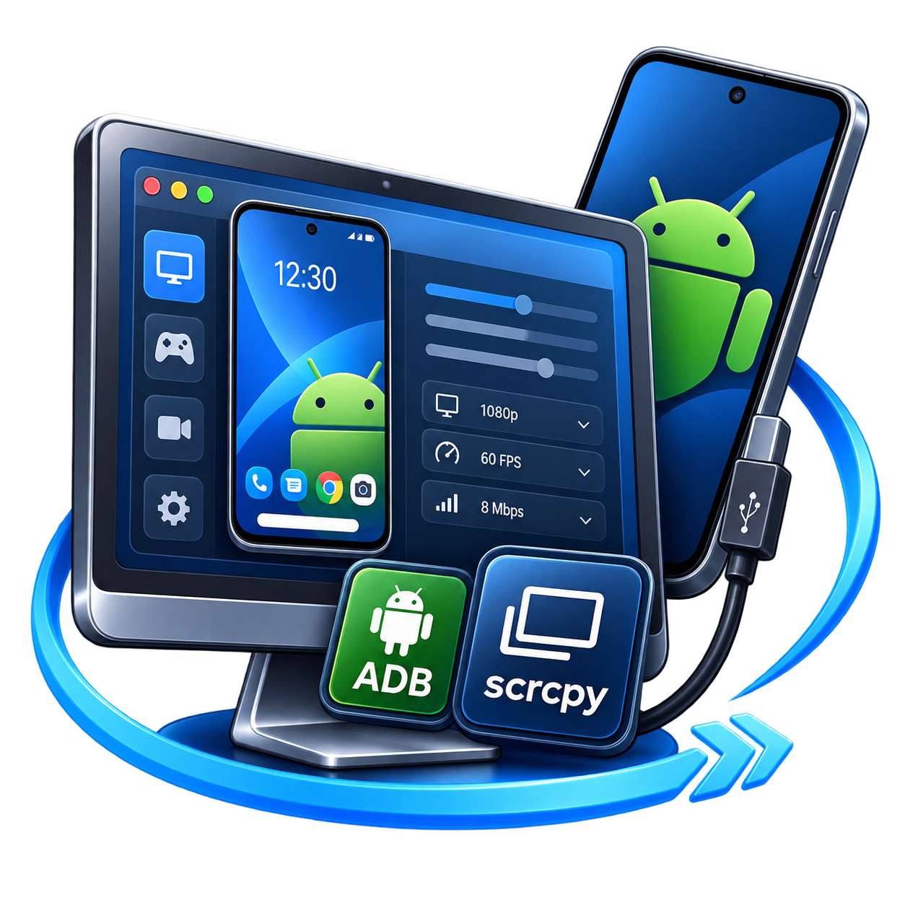
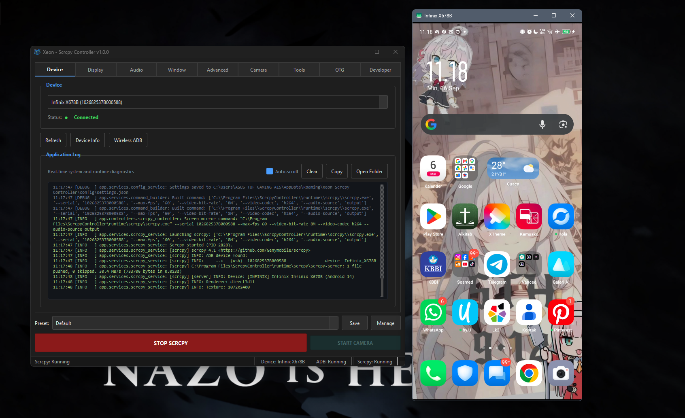
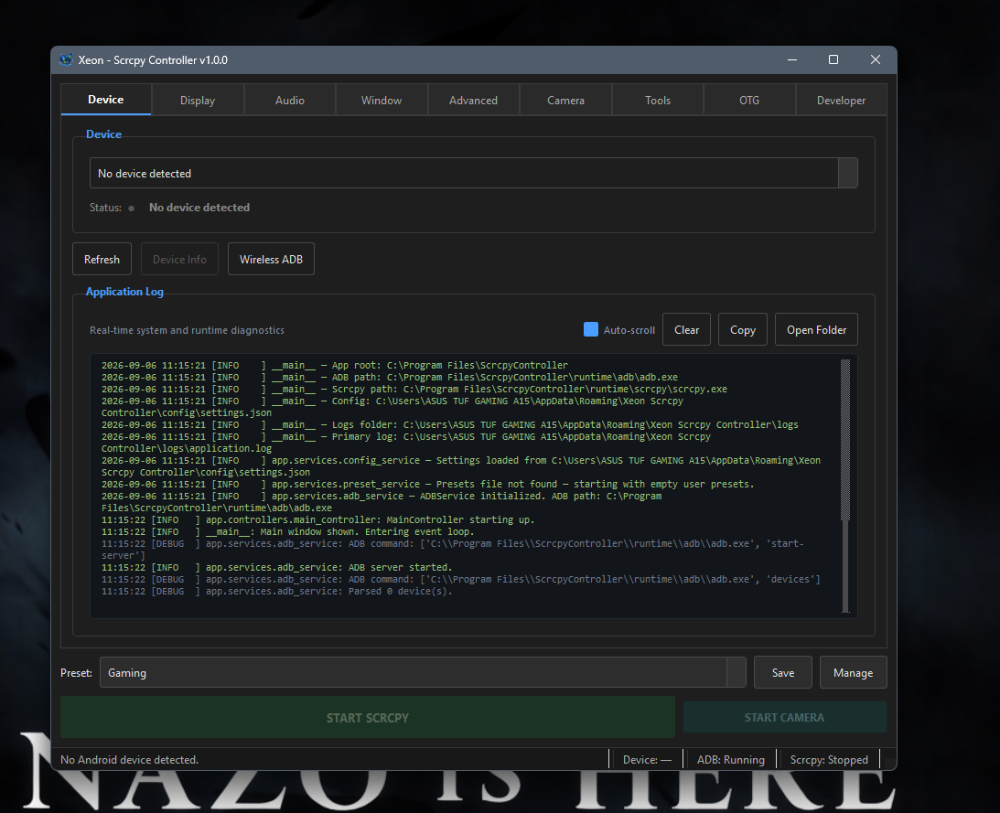
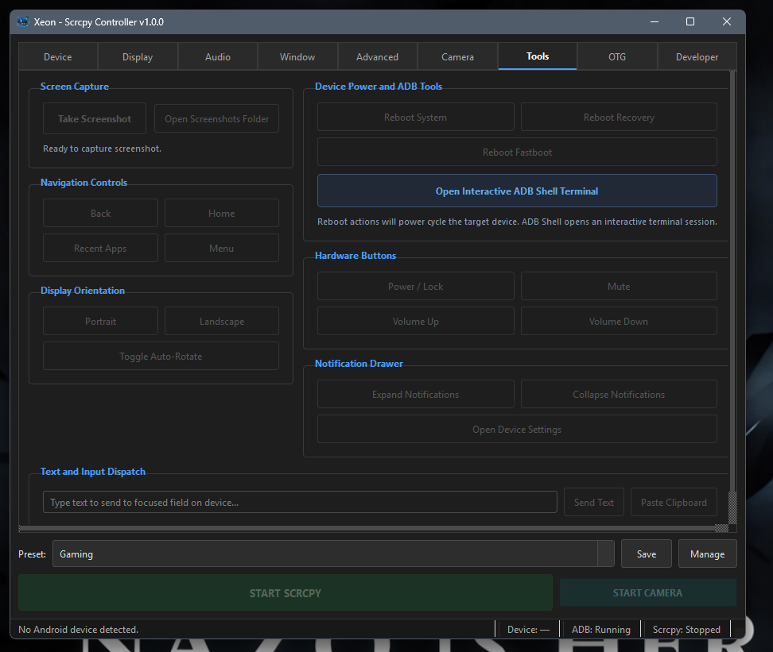

<p align="center">
  
</p>

<h1 align="center">Xeon - Scrcpy Controller GUI</h1>

<p align="center">
  A modern, high-performance desktop controller and graphical interface for Android device mirroring, camera streaming, OTG input passthrough, and advanced ADB management. Built with Python 3.12 and PyQt6, powered by Genymobile Scrcpy and the Android Debug Bridge (ADB).
</p>

<p align="center">
  <a href="https://github.com/AlfandoXeon/ScrcpyControllerGUI/releases/download/ScrcpyController/XeonScrcpyController_Setup_v1.0.0.exe">
    
  </a>
</p>

---

## Download & Installation

The official release provides a standalone, pre-packaged Windows 64-bit installer with bundled portable runtimes (Scrcpy v4.1 and ADB Platform Tools). No prior Python or manual dependency configuration is required for end users.

- **Direct Download Link:** [XeonScrcpyController_Setup_v1.0.0.exe](https://github.com/AlfandoXeon/ScrcpyControllerGUI/releases/download/ScrcpyController/XeonScrcpyController_Setup_v1.0.0.exe)
- **Target OS:** Windows 10 / Windows 11 (64-bit)
- **Package Release:** v1.0.0

---

## Screenshots

### Device Mirroring Session
High-definition, low-latency Android display mirroring displayed alongside the real-time application controller and diagnostic log viewer.



### Device Management & Live Application Diagnostics
Inspect connected devices, transport states, wireless ADB pairing, and real-time color-coded diagnostic logs.



### Quick Tools, Power Controls & Interactive ADB Shell
Hardware key emulation, direct screenshot capture, power cycling (System, Recovery, Fastboot), and an embedded interactive ADB shell terminal.



---

## Key Features

### Screen Mirroring
- High-resolution, low-latency video streaming over USB or TCP/IP (Wi-Fi).
- Configurable video parameters: custom resolution bounds, framerates (up to 120 FPS), and bitrates (2 Mbps to 64 Mbps).
- Video codec selection: H.264 (AVC), H.265 (HEVC), and AV1.
- Custom video encoder selection queryable directly from the connected hardware.
- Secondary and virtual display selection (`--display-id`).

### Audio Forwarding
- Integrated low-latency audio capture and playback through PC audio outputs.
- Multiple audio codecs supported: OPUS, AAC, FLAC, and RAW PCM.
- Configurable audio bitrates and buffer latency controls.
- Audio duplicate mode (`--audio-dup`) to simultaneously play audio on both device and computer.

### Dedicated Camera Mode
- Direct Android camera streaming to PC (`--video-source=camera`) without mirroring device display.
- Camera switching between front-facing and back-facing sensors.
- Custom camera capture resolutions and framerate configuration.
- High-speed camera capture support where supported by hardware.

### OTG Mode (Hardware Passthrough)
- Physical keyboard and mouse simulation using Linux kernel UHID drivers.
- Operates without screen mirroring for zero-latency typing and ultra-low battery consumption.
- Bypasses traditional Android input event limitations on restricted operating systems.

### Quick Tools & Device Action Bar
- Direct PC Screenshot Capture: Captures lossless PNG screenshots straight to the host machine without saving temporary files to device storage.
- Navigation Controls: One-click software buttons for Back, Home, Recent Apps (Task Switcher), and Menu.
- Hardware Button Emulation: Remote triggers for Power / Screen Lock, Volume Up, Volume Down, and Mute.
- Orientation Controls: Lock to Portrait, lock to Landscape, or toggle System Auto-Rotate.
- Notification Drawer: Expand notifications, collapse drawer, and open Android Settings directly.
- Text & Clipboard Dispatch: Send raw ASCII text into active text fields or paste PC clipboard contents to device.

### Device Power & ADB Reboot Tools
- Reboot System: Standard graceful device restart.
- Reboot Recovery: Fast access to Android recovery mode for maintenance or sideloading.
- Reboot Bootloader: Immediate transition to Fastboot / Bootloader mode.
- Interactive Confirmation: Built-in safety confirmation prompts preventing accidental reboot interruptions during work.

### Interactive Custom ADB Shell Terminal
- Embedded standalone terminal window built in PyQt (no external command prompts required).
- Security Warning Prompt: Explicit permission gate warning users before executing raw low-level operating system commands.
- Asynchronous Command Streaming: Real-time standard output and error display via non-blocking process pipes.
- Command History Navigation: Cycle through previous commands using Up and Down arrow keys.
- Quick Inspection Chips: Instant one-click triggers for user-installed apps (`pm list packages -3`), Android version (`getprop`), storage metrics (`df -h`), battery parameters (`dumpsys battery`), and Wi-Fi network configuration.
- Execution Controls: Interrupt / Stop button (SIGINT/kill emulation), clear terminal buffer, and session termination.

### Live Application Diagnostic Log
- Monospace real-time log viewer embedded directly inside the Device panel.
- Live stream of all application events, ADB command arguments, Scrcpy lifecycle states, and error traces.
- Color-coded severity syntax: Green for INFO, Amber for WARNING, Red for ERROR/CRITICAL, Gray for DEBUG.
- Viewer controls: Auto-scroll toggle, Clear buffer, Copy to clipboard, and Open Log Folder in Windows Explorer.

### Preset and Configuration System
- Save and organize custom configurations into reusable profiles (e.g. High Performance Gaming, Presentation, Low Latency).
- Preset manager dialog allowing creation, duplication, renaming, and deletion of custom settings.

---

## Architecture Overview

The application follows a structured Model-View-Controller (MVC) architecture designed for responsiveness and stability:

- **Models (`app/models/`)**: Strongly typed data representations for device states, Scrcpy configuration options, presets, and transport types.
- **Views (`app/views/`)**: Modular PyQt6 panels categorized by responsibility (Device, Display, Audio, Window, Advanced, Camera, Tools, OTG, Developer), unified under a responsive main window.
- **Controllers (`app/controllers/`)**: Decoupled orchestrators handling business logic, user intent dispatch, and cross-subsystem event handling.
- **Services (`app/services/`)**: Asynchronous subprocess runners utilizing `QRunnable` and `QThreadPool` for non-blocking ADB command execution, socket parsing, and Scrcpy process lifecycle supervision.
- **Utilities (`app/utils/`)**: Path resolution for both development environments and PyInstaller frozen states, thread-safe Qt log handlers, and OS integrations.

---

## Requirements

### Host Environment
- Windows 10 or Windows 11 (64-bit)
- Python 3.10, 3.11, or 3.12 (Python 3.12 recommended for source execution)
- Bundled runtime dependencies: Genymobile Scrcpy v4.1 and Android Platform Tools (ADB)

### Android Device
- Android 5.0 (Lollipop) or newer (Android 11+ required for wireless pairing, Android 12+ for certain audio features).
- Developer Options unlocked with **USB Debugging** enabled.

---

## Installation & Setup from Source

### 1. Clone Repository
```bash
git clone https://github.com/AlfandoXeon/ScrcpyControllerGUI.git
cd ScrcpyControllerGUI
```

### 2. Set Up Virtual Environment (Recommended)
```bash
python -m venv .venv
.venv\Scripts\activate
```

### 3. Install Python Dependencies
```bash
python -m pip install --upgrade pip
pip install -r requirements.txt
```

For development and unit test running:
```bash
pip install -r requirements-dev.txt
```

### 4. Run Application
```bash
python app/main.py
```

---

## Building Standalone Executable

The repository includes an automated build script (`build.bat`) configured for PyInstaller `--onedir` distribution:

```bash
build.bat
```

### Build Artifacts Structure
Upon completion, the distribution directory `dist/ScrcpyController/` will contain:
```
dist/ScrcpyController/
├── ScrcpyController.exe       # Main application executable (no console window)
├── _internal/                 # Isolated Python binaries, Qt libraries, and dependencies
├── runtime/                   # Portable Scrcpy and ADB binaries
│   ├── scrcpy/                # scrcpy.exe, scrcpy-server, SDL3, FFmpeg DLLs
│   └── adb/                   # adb.exe, AdbWinApi.dll, AdbWinUsbApi.dll
├── LogoAplikasi/              # High-resolution application artwork
├── app/resources/             # Bundled application icons
├── config/                    # User configuration storage directory
└── logs/                      # Application runtime diagnostics directory
```

---

## Running Automated Tests

To execute the unit test suite:
```bash
python -m pytest
```

---

## Device Specific Configuration Notes

### Xiaomi / POCO / Redmi (MIUI & HyperOS)
On Xiaomi devices running MIUI or HyperOS (including Android 15 and Android 16), Xiaomi enforces proprietary permission barriers on input injection.

If you encounter `SecurityException: Injecting input events requires the caller to have the INJECT_EVENTS permission`:
1. Navigate to **Settings** > **Additional Settings** > **Developer Options**.
2. Locate the toggle **USB Debugging (Security Settings)** directly below the primary USB Debugging option.
3. Enable the setting (requires an active Mi Account and SIM card verification).
4. Reboot the device if prompted.

Alternatively, you can use **OTG Mode** from the application's OTG tab, which operates via Linux kernel hardware emulation and does not require `INJECT_EVENTS` permission.

---

## License

This project is open-source under the MIT License. Refer to the [licenses](licenses/) directory for third-party component licenses including Genymobile Scrcpy and Google Android Platform Tools.
